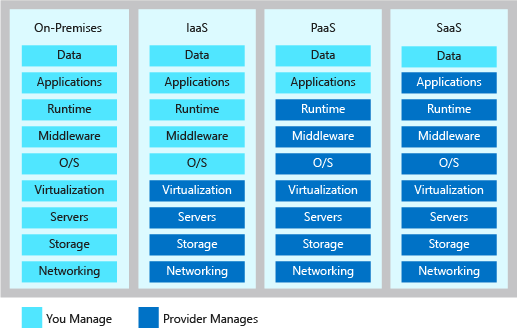

# Cloud Computing – Training Notes

An overview of key cloud computing concepts, models, providers, and use cases.

---

## What is Cloud?

Cloud computing is the on-demand delivery of IT resources such as storage, compute, databases, networking, and software over the internet. Instead of owning physical infrastructure, companies rent resources from cloud providers and scale them as needed.

---

## History of Cloud Computing

- **1960s:** Early concepts by J.C.R. Licklider (intergalactic computer network).
- **1999:** Salesforce launched as the first major SaaS platform.
- **2006:** Amazon Web Services (AWS) introduced EC2 and S3 – the modern public cloud begins.
- **2010s–Now:** Rapid growth of Microsoft Azure, Google Cloud Platform (GCP), and multi-cloud strategies.

---

## 4 Main Cloud Deployment Models

| Cloud Model       | Description                                                   |
|-------------------|---------------------------------------------------------------|
| **Public Cloud**  | Services offered over the public internet (e.g., AWS, Azure). |
| **Private Cloud** | Cloud resources used exclusively by one organisation.         |
| **Hybrid Cloud**  | Mix of public and private cloud infrastructure.               |
| **Multi Cloud**   | Using multiple cloud providers at the same time.              |

---

## 3 Main Cloud Service Types

| Service Types                          | Description                                                            |
|----------------------------------------|------------------------------------------------------------------------|
| **IaaS** (Infrastructure as a Service) | Access to raw compute, storage, networking (e.g., AWS EC2)             |
| **PaaS** (Platform as a Service)       | Tools to develop, run, and manage apps without handling infrastructure |
| **SaaS** (Software as a Service)       | Ready-to-use applications delivered via web (e.g., Gmail, Office 365)  |

---

## Other Common Cloud Service Models

- **FaaS**: Function as a Service (e.g., AWS Lambda)
- **BaaS**: Backend as a Service (e.g., Firebase)
- **DaaS**: Data as a Service
- **CaaS**: Container as a Service (e.g., Azure Kubernetes Service)

---

## Examples of IaaS, PaaS, SaaS

| Model  | Examples                              |
|--------|---------------------------------------|
| IaaS   | AWS EC2, DigitalOcean, Rackspace      |
| PaaS   | Google App Engine, Microsoft Azure    |
| SaaS   | Google Workspace, Netflix, Salesforce |

---

## Current Market Share (as of Q1 2025)

- **Amazon Web Services (AWS)** – ~31%
- **Microsoft Azure** – ~21%
- **Google Cloud Platform (GCP)** – ~12%
- Others (IBM Cloud, Oracle, Alibaba Cloud) make up the rest.

---

## What Are Each Cloud Provider Known For?

| Provider | USP / Strengths                                    |
|----------|----------------------------------------------------|
| **AWS**  | Market leader, wide service range, early mover     |
| **Azure**| Enterprise-friendly, seamless with Microsoft tools |
| **GCP**  | Strong in data, analytics, AI/ML, cost-effective   |

---

## Advantages of Cloud Computing

- Scalability & flexibility
- Pay-as-you-go pricing
- High availability and disaster recovery
- Global reach
- Reduced capital costs

## Disadvantages

- Vendor lock-in
- Downtime risks
- Data privacy and compliance concerns
- Requires internet connection

---

## What You Usually Pay for

- Compute (VMs, containers, functions)
- Storage (object, block, file)
- Network traffic (in/out)
- Databases, APIs, and support

## What You Don't Usually Pay for

- Inbound data transfer (to the cloud)
- Many monitoring tools (basic tiers)
- Documentation, SDKs, and CLI tools

---

## Case Studies

1. **Netflix (AWS):**  
   Migrated from on-prem to AWS to support global scale, dynamic load, and streaming performance.

2. **Spotify (GCP):**  
   Leveraged GCP for data analytics, machine learning, and scalability of audio processing.

3. **Coca-Cola (Azure):**  
   Used Azure to modernise vending machine data collection and automate sales insights.

---

## AI/ML Offerings on the Cloud

- **AWS:** SageMaker, Bedrock, Transcribe, Rekognition
- **Azure:** Azure ML, Cognitive Services, OpenAI integration
- **GCP:** Vertex AI, AutoML, BigQuery ML, Dialogflow

---

## What Are AI Agents?

AI agents are systems that can autonomously take actions based on goals, inputs, or real-time data using models, tools, memory, and logic (e.g., LangChain, AutoGPT). They often combine LLMs with external data sources or actions.

---

## Bonus: Data-Focused Cloud Services

- **AWS:** Redshift, Glue, Athena, Lake Formation
- **Azure:** Synapse, Data Factory, Purview
- **GCP:** BigQuery, Dataflow, Dataproc

---

## Bonus: Data Cloud Certification Paths

| Cloud | Certification Path Example                            |
|-------|-------------------------------------------------------|
| AWS   | Cloud Practitioner → Data Analytics Specialty         |
| Azure | Azure Fundamentals → Azure Data Engineer              |
| GCP   | Associate Cloud Engineer → Professional Data Engineer |

---
