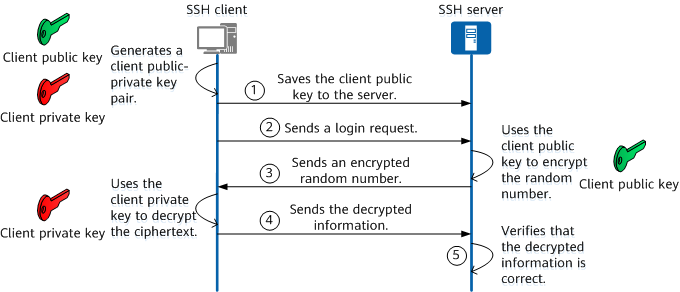

# SSH Notes – Secure Shell

A guide to understanding SSH, its purpose, how it works, and how to use it with Git and GitHub.

---

## What is SSH?

**SSH (Secure Shell)** is a cryptographic network protocol that allows secure communication between two computers over an insecure network (like the internet).

It uses encryption to keep your commands, data, and credentials private — typically used for accessing remote machines and transferring files securely.

---

## What is SSH Used For?

- Logging into remote servers (e.g. Linux VM on a cloud provider)
- Running remote commands
- Secure file transfers (`scp`, `sftp`)
- Tunnelling and port forwarding
- Authenticating with services like GitHub without entering your username/password

---

## How Does SSH Work?

SSH uses a **client-server model** with **public-key cryptography**. When you connect:

1. The client (your machine) sends its public key to the server.
2. The server verifies the public key and checks that the client has the **matching private key**.
3. If they match, the connection is authenticated and encrypted.

Think of it like:

> **Public key = open padlock**  
> **Private key = the secret key to unlock it**  
> You give someone your padlock (public key), and only you can unlock it with your private key.

---

## Public Key vs Private Key

| Key Type        | Description                                   |
| --------------- | --------------------------------------------- |
| **Public Key**  | Shared openly. Placed on remote servers.      |
| **Private Key** | Kept secret. Stored locally on your computer. |

- The keys are generated as a pair and must match.
- Private key must never be shared.

**Common SSH key types:**

- RSA
- ED25519 (recommended for newer systems)

---

## Why Use SSH?

- Secure: Encrypted authentication and communication
- Passwordless: You don’t need to type credentials every time
- Trusted: Used by sysadmins, devs, and cloud engineers everywhere
- Required: Some services (like GitHub) prefer SSH for scripting

---

### Diagram



**Analogy:**  
Imagine mailing a locked box (your Git request) and only the receiver (GitHub) can unlock it because they already have your padlock (public key), and you’re the only one who has the key (private key).

---

## Can You Push to GitHub Using SSH?

Yes, GitHub supports pushing via SSH as an alternative to HTTPS.

Advantages of SSH over HTTPS:

- No need to enter your username/password or personal access token each time
- Better for automation (scripts, CI/CD)
- One-time setup with long-term benefit

---

## Full SSH GitHub Push Setup – Documented Process

This section outlines the full, successful process I followed to push a GitHub repository using SSH instead of HTTPS, with explanations and expected outputs.

### 1. Generate a new SSH key

```bash
ssh-keygen -t rsa -b 4096 -C "malom@spartaglobal.com"
```

Creates a strong key pair. I saved it as `mahdi-github-keypair`.

### 2. Copy and add the public key to GitHub

```bash
cat ~/.ssh/mahdi-github-keypair.pub
```

Paste the key into GitHub → Settings → SSH and GPG Keys → New SSH Key.

### 3. Start the SSH agent

```bash
eval "$(ssh-agent -s)"
```

Starts the key manager. Output looks like: `Agent pid 960`

### 4. Add your private key to the agent

```bash
ssh-add ~/.ssh/mahdi-github-keypair
```

Expected: `Identity added: mahdi-github-keypair (...)`

### 5. Test connection to GitHub

```bash
ssh -T git@github.com
```

First time: asks if you trust the host. After yes:

```
Hi Madster778! You've successfully authenticated, but GitHub does not provide shell access.
```

### 6. Initialise a local Git repo and push

```bash
cd /f/SpartaGlobal/GitRepos
mkdir ssh_test_repo
cd ssh_test_repo
git init
echo "# SSH Test Repo" > README.md
git add .
git commit -m "Initial commit"
```

### 7. Link GitHub repo using SSH

```bash
git remote add origin git@github.com:Madster778/ssh_test_repo.git
git push -u origin main
```

This pushed successfully and connected using SSH.

---

Once the SSH key is set up and added to the agent, you can securely push, pull, and clone from GitHub without ever entering a password again.
